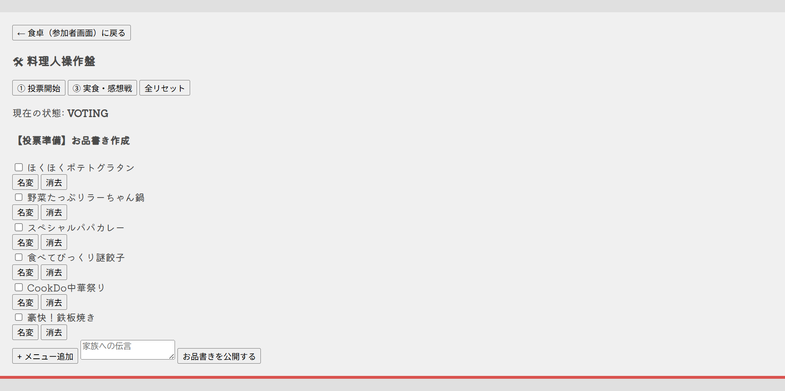
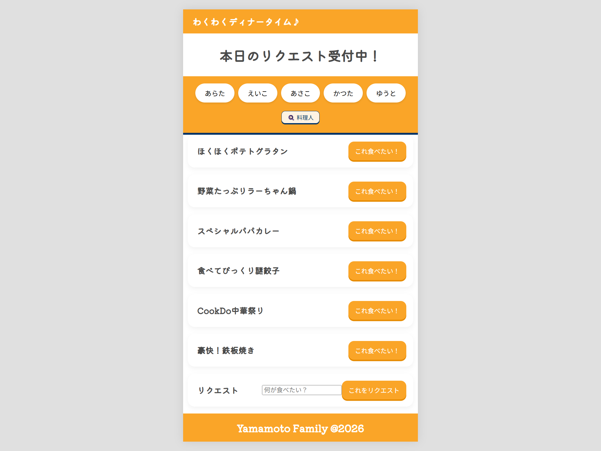
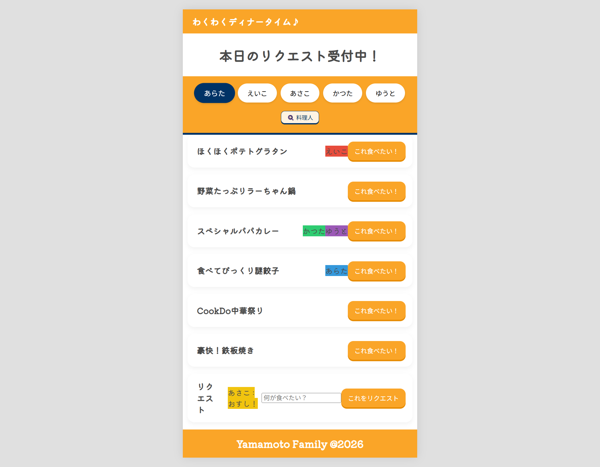
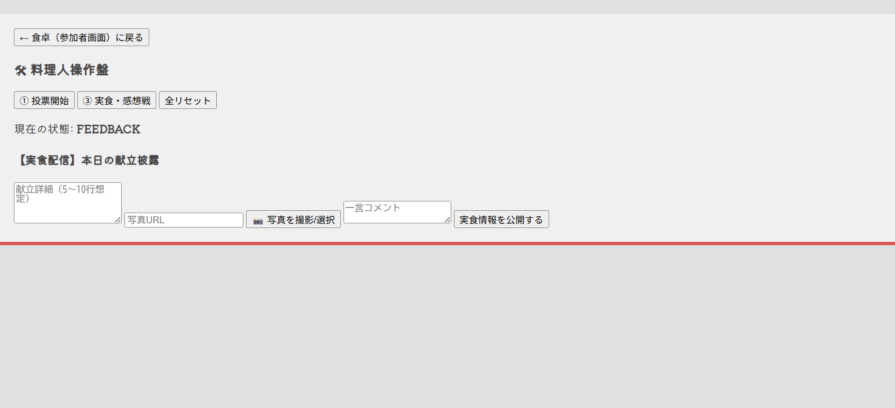
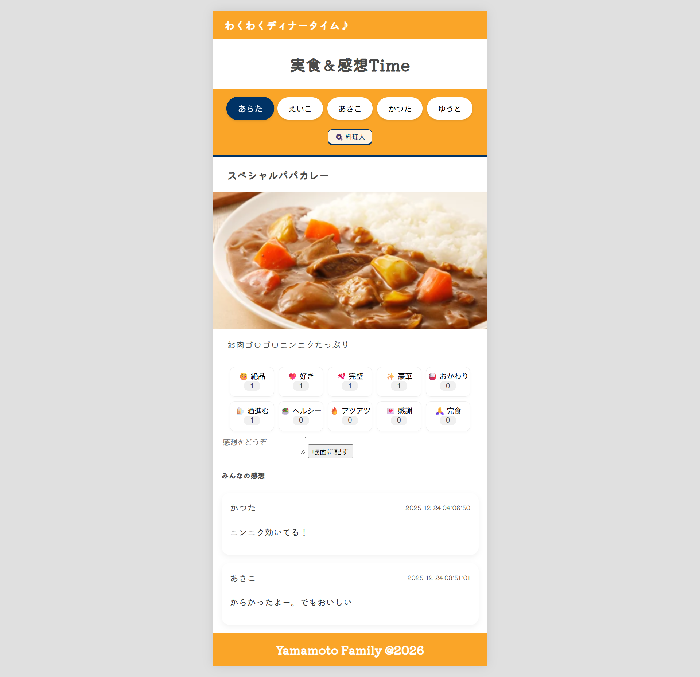

# 1. -タイトル わくわくディナータイム♪アプリ（令和版食卓の情景）　

## 2. 課題内容（どんな作品か）
   - 家族の夕食の時間を最高に楽しくするアプリです 
   - 料理人（管理者）が場面を選びます
   - 料理人（管理者）が本日のメニュー候補を編集して公開すると
   - 家族（ユーザー）は食べたいメニューをリクエストできます。リアルタイムで誰が何食べたいか見ることができます
   - 料理人（管理者）は料理が完成したら場面を「実食＆感想モード」に切り替え、タイトル、写真、コメントを投稿します
   - 家族（ユーザー）は食中、食後にスタンプ＆コメントで料理の感想を表現できます
   - 食後に保存ボタンを押すと、料理のタイトル、写真、料理人からのコメント、スタンプ＆家族のコメントがアーカイブ化されます。（未実装。力尽きました・・）
   - 本当は、「実況中継モード」も作りたかった。買い出しの様子や調理中の様子を配信するような。（未実装。力尽きました・・）

      
      
      
      
      

## 3. アプリのデプロイURL
   - https://aratabplp-boop.github.io/Family-Dinner/

## 4. ログイン＆パスワード
   -  なし

## 5. 工夫した点、こだわった点
   -  池波正太郎さんの「食卓の情景」という本が好きで、食事日記から発想のヒントを得ています　 
   -  日本にいる時、週末クッキングは僕の役割なのですが、メニューをみんなで考える所から結構楽しいんですよね。
   　　食事をめぐる家族の会話をもっと豊かにしながら、かけがえのない思い出が蓄積されていくアプリを作ってみたかった、です
   - 　管理者による場面の切り替え機能に初挑戦しました。現在の場面をテーブルに投げることで、どこから誰がアクセスしても同じ場面になる（はず）
   - 　要素は複雑ですが、できるだけシンプルなUIになるように心がけました（管理者画面を整えるまでの余力はなく・・）
   
## 6. 備考（備忘録） 
   -  管理者×ユーザーと場面の切り替え　の初期設計が甘かった。つくりながら挙動を変えていったので、テーブルを5回くらい増改築した。そこまで書いてたコードと整合性がとれなくなることがあった。
   - 　db⇔api.php⇔JS⇔HTMLと一気通貫で動かすのは本当に難しい・・・。チーズアカデミーの頃が懐かしい・・・
   - 　モード切替時にいろいろな情報をテーブルから持ってきてJSで動かすところが複雑になりすぎてる・・・ので、残された時間でアーカイブ機能をオンするのを断念。
